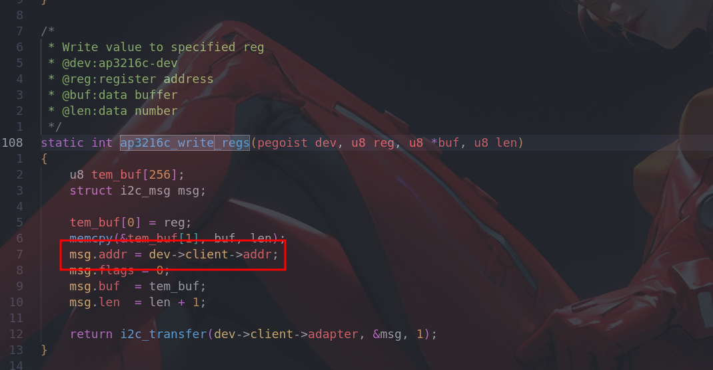
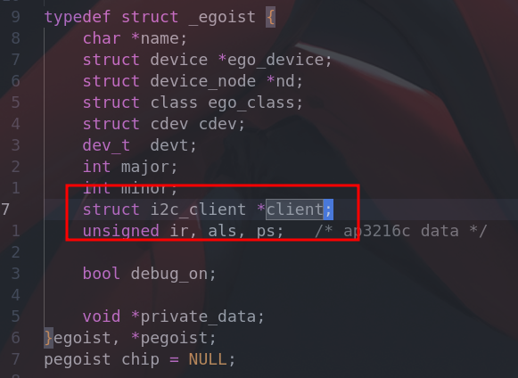
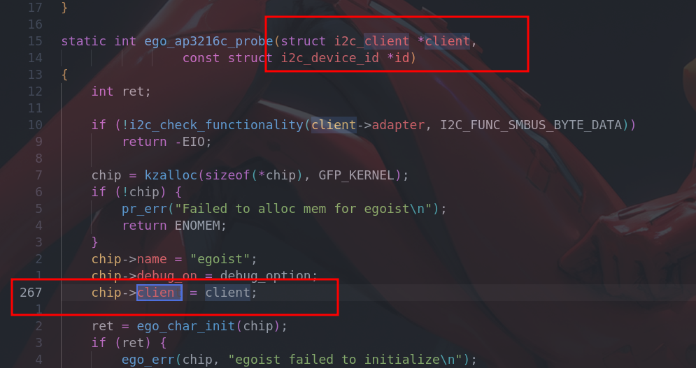

# linux_driver_development
As you can see, this repository is used for keeping tract of my driver development practicing.
In this repository, I'll upload my linux driver codes which is vertical verifyed locally by me.

If you have some question, please feel free to leave message or test me directly. I will be very glad if I can give some help to you.


**Note:**

All drivers are developed based on linux-kernel-4.1.15


## Question Record

#### -1- Driver had been registered

```bash
Error: Driver `ap3216c` is already registered, aborting...
```

The driver that I'm going to insmod named `ap3216c` and it's a driver for I2C device. So I went to the directory `/sys/bus/i2c/drivers/` to check if there were drivers with the same name. There was a directory entry named `ap3216c` as expected. Although it didn't run it's probe, this driver was already registered to corresponding bus(I2C) though `module_i2c_driver`.

To avoid this problem:

- change my own driver's name
- change the registered but conflicting driver's name
- remove compile item of the conflicting driver in the Makefile

---

#### -2-Unable to handle kernel NULL pointer

```bash
Unable to handle kernel NULL pointer dereference at virtual address 00000002
...
PC is at ap3216c_write_regs.constprop.0+0x24/0x50 [ego_ap3216c]
...
Segmentation fault
```

I've got crazy about this question, it looks like I had manipulated a NULL pointer. According to the above error-message, jump to the source code `ap3216c_write_regs` as below shows.



Note the area in the red box, `dev->client` is chief culprit. It's declared as a pointer,  I just initialize the structure `egoist` it belongs to but forgot to give it a initial value.



To solve this problem, just give the parameter `client` in `probe` as follows:




