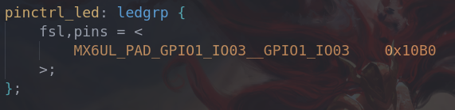
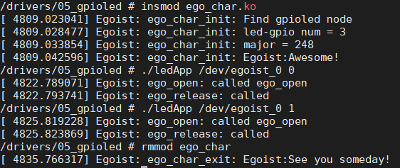

# Character device driver : Egoist

| Author  | Date      | Description                                                  |
| ------- | --------- | ------------------------------------------------------------ |
| Manfred | 2023/4/8  | First release : The basic character device framework is implemented |
| Manfred | 2023/4/16 | Implement a actual led driver on the basis of driver `ego_char` |

## Introduce

After running `make` in the terminal, there will be  several modules as follow:

- ego_char.ko
- ego_char_led.ko

For the `ego_char.ko`, it implements a common template for **character drivers**. You can apply it and then your efficiency will be as fast as a rocket.

The second one named `ego_char_led.ko`, it's designed to control a actual led device on my development-board, just turn on and off of it. I will outline the development process of it to make it to be understanding better.

## Usage

### ego_char

You can specify the numbers of devices that you want to create by `sudo insmod ego_char.ko count=x`, after loading the module, there will be `/dev/egoist_0, /dev/egoist_1, /dev/egoist_2 ... ...`, there will also be a class created for these devices:`/sys/class/ego_class`.

If you load the driver directly, there will be a log:`Awesome` which show you do the things upon successfully.

```shell
[Ego]ego_char_init Egoist:Awesome!
```

After you unload the module, there will be a log as follow:

```shell
[Ego]ego_char_exit Egoist:See you someday!
```

> If you don't want to see this log again, you can set `debug_option` false as below:
>
> ```c
> static bool debug_option = false;    /* hard-code control debugging */
> ```

---

Anyway, after you created the module completely, it's time to test thing with it. What you need to do is just operate the file node `/dev/egoist_x`

### ego_char_led

It's easy to achieve a char-dev to operate a led. <u>But we can understand some of the actual development process through its implementation.</u>

---

First of all, we'd better have a look on the specific hardware schematic diagram. The device I used is `Alpha I.MX` which is produced by `alientek`.


As shown on the figure. The only thing we need to do to light the `led` is just pulling `LED0` down horizontally. So it's time to gain control of the pin.

In linux kernel, there are two sub-system `pinctrl` and `gpio`, the former is responsible for pin multiplexing and electrical parameter setting as the other one is for specific gpio-setting. We can easily pass specific hardware parameters to them through the flat-device-tree. Coding in the `imx6ull-alientek-emmc.dts` as follows:




What I did was tell the hardware details to these two subsystems `pinctrl` and ``gpio`. The rest is just a matter of calling the APIs provide by them. 

> Different chips corresponds to different coding methods, you can watch the kernel_source/Document/ for more details

In our driver, we get the `GPIO-NUM` from `device-node` abstracted from the device tree. Then call the corresponding APIs to control the GPIO

```c
/* Config GPIO -1- Get the gpio node*/
chip->nd = of_find_node_by_path("/gpioled");
if (!chip->nd) {
    ego_err(chip, "Not get gpioled node\n");
    return -EINVAL;
}
ego_debug(chip, "Find gpioled node\n");
/* Config GPIO -2- Get the property of gpioled node for gpio_num */
chip->gpio_num = of_get_named_gpio(chip->nd, "led-gpio", 0);
if (chip->gpio_num < 0) {
    ego_err(chip, "Can't access the led-gpio");
    return -EINVAL;
}
ego_debug(chip, "led-gpio num = %d\n", chip->gpio_num);
/* Config GPIO -3- Set the direction of the GPIO */
ret = gpio_direction_output(chip->gpio_num, 1);
if (ret < 0) {
    ego_err(chip, "Can't set gpio\n");
}

/*================================================================*/

enum LED_STATUS {
    LED_OFF,
    LED_ON,
    STATUS_MAX,
};
static ssize_t ego_write(struct file *filp, const char __user *buf, size_t count, loff_t *offset)
{
	int retvalue;
	unsigned char databuf[1];
	unsigned char ledstat;
	struct egoist *dev = filp->private_data;

	retvalue = copy_from_user(databuf, buf, count);
	if(retvalue < 0) {
		printk("kernel write failed!\r\n");
		return -EFAULT;
	}

	ledstat = databuf[0];		/* 获取状态值 */

	if(ledstat == LED_ON) {
		gpio_set_value(dev->gpio_num, 0);	/* 打开LED灯 */
	} else if(ledstat == LED_OFF) {
		gpio_set_value(dev->gpio_num, 1);	/* 关闭LED灯 */
	}
	return 0;
}
```

After loading this driver.ko , the result is as below:



Meanwhile, the led(RED) lights off and on in my Alpha board.


---

I will explain the analysis of gpio and pinctrl subsystems in the following documents of mine. Welcome to call me for more.


