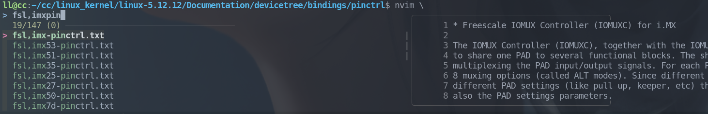
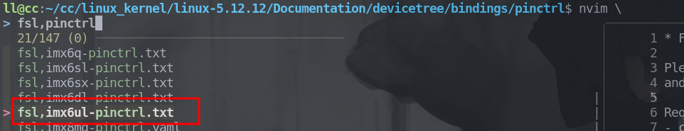
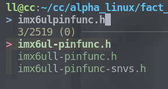
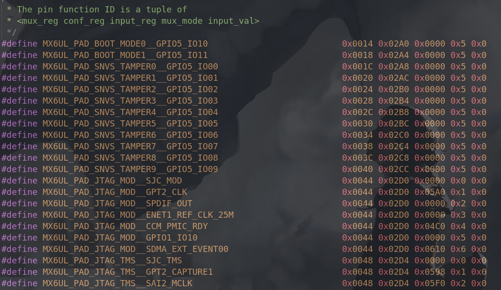

# PINCTRL & GPIO Subsystem

> 参考正点原子Alpha.IMX6ULL

## Pinctrl 子系统

- 获取设备树中的PIN信息
- 根据PIN信息配置PIN的复用功能
- 根据PIN信息配置PIN的电气特性（上/下拉、速度、驱动能力）


**Question**

如何获取设备树信息？


### Code Trace

#### PINCTRL参数解析驱动

<u>linux-5.12.12/drivers/pinctrl/freescale/pinctrl-imx6ul.c</u>

```c
static const struct of_device_id imx6ul_pinctrl_of_match[] = {
	{ .compatible = "fsl,imx6ul-iomuxc", .data = &imx6ul_pinctrl_info, },
	{ .compatible = "fsl,imx6ull-iomuxc-snvs", .data = &imx6ull_snvs_pinctrl_info, },
	{ /* sentinel */ }
};

static int imx6ul_pinctrl_probe(struct platform_device *pdev)
{
	const struct imx_pinctrl_soc_info *pinctrl_info;

	pinctrl_info = of_device_get_match_data(&pdev->dev);
	if (!pinctrl_info)
		return -ENODEV;

	return imx_pinctrl_probe(pdev, pinctrl_info);
}

static struct platform_driver imx6ul_pinctrl_driver = {
	.driver = {
		.name = "imx6ul-pinctrl",
		.of_match_table = of_match_ptr(imx6ul_pinctrl_of_match),
	},
	.probe = imx6ul_pinctrl_probe,
};

static int __init imx6ul_pinctrl_init(void)
{
	return platform_driver_register(&imx6ul_pinctrl_driver);
}
arch_initcall(imx6ul_pinctrl_init);
```

此子为平台设备驱动，通过`line28-platform_driver_register` 注册到平台总线维护的驱动链表中，当内核解析到设备树之后，即对应设备注册到平台总线维护的设备链表中，彼此的`compatible`开始比较。成功则对应的`probe`函数执行。

---

`line11：`根据设备树中配置的`compatible`的值获取`imx6ul_pinctrl_of_match`中不同的`.data`信息，进而在随后的`imx_pinctrl_probe`解析不同的参数配置

```c
pinctrl_info = of_device_get_match_data(&pdev->dev);
```


#### PINCTRL设备树信息配置

切入内核源码目录：`linux-5.12.12/Documentation/devicetree/bindings/pinctrl`找寻信息配置格式，alpha开发板使用的芯片是飞思卡尔的imx系列，遂如下：



```c
Freescale IMX pin configuration node is a node of a group of pins which can be
used for a specific device or function. This node represents both mux and config
of the pins in that group. The 'mux' selects the function mode(also named mux
mode) this pin can work on and the 'config' configures various pad settings
such as pull-up, open drain, drive strength, etc.
```

概述如上，Freescale IMX PIN配置是通过配置`node`的方式实现的，`node`包含了`mux`和`config`，分别对应引脚的复用功能和电气特性

---

```c
Required properties for iomux controller:
- compatible: "fsl,<soc>-iomuxc"
  Please refer to each fsl,<soc>-pinctrl.txt binding doc for supported SoCs.

Required properties for pin configuration node:
- fsl,pins: each entry consists of 6 integers and represents the mux and config
  setting for one pin. The first 5 integers <mux_reg conf_reg input_reg mux_val
  input_val> are specified using a PIN_FUNC_ID macro, which can be found in
  imx*-pinfunc.h under device tree source folder. The last integer CONFIG is
  the pad setting value like pull-up on this pin. And that's why fsl,pins entry
  looks like <PIN_FUNC_ID CONFIG> in the example below.
```

来看看配置前的依赖

1、兼容性字段`fsl,<soc>-iomuxc`，复用控制器需要

内核目录`Documents/devicetree/bindings/pinctrl/`下存在文件`fsl,imx6ull-pinctrl.txt`，即代表ALPHA.IMX6UL受支持



2、属性`fsl,pins`，配置引脚参数

每个引脚参数条目由6位整数构成，前5位使用在设备树源码文件`imx*-pinfunc.h`中定义的宏，最后一位整数代表该PAD的设置值





---

如下是末尾给出的示例，可以看到`iomuxc`表示的引脚复用控制器使用了兼容性字段`fsl,imx6q-iomuxc`标记

随后给出的属性字段`fsl,pins`中包含了一堆宏，即引脚配置列表，这些配置在 line-5 中以 phandle的形式被 `pinctrl-0`引用，**即提供了设备某种状态所需的`pinctrl`配置列表**

**Example**

```c
usdhc@219c000 { /* uSDHC4 */
	non-removable;
	vmmc-supply = <&reg_3p3v>;
	pinctrl-names = "default";
	pinctrl-0 = <&pinctrl_usdhc4_1>;
};

iomuxc@20e0000 {
	compatible = "fsl,imx6q-iomuxc";
	reg = <0x020e0000 0x4000>;

	/* shared pinctrl settings */
	usdhc4 {
		pinctrl_usdhc4_1: usdhc4grp-1 {
			fsl,pins = <
				MX6QDL_PAD_SD4_CMD__SD4_CMD    0x17059
				MX6QDL_PAD_SD4_CLK__SD4_CLK    0x10059
				MX6QDL_PAD_SD4_DAT0__SD4_DATA0 0x17059
				MX6QDL_PAD_SD4_DAT1__SD4_DATA1 0x17059
				MX6QDL_PAD_SD4_DAT2__SD4_DATA2 0x17059
				MX6QDL_PAD_SD4_DAT3__SD4_DATA3 0x17059
				MX6QDL_PAD_SD4_DAT4__SD4_DATA4 0x17059
				MX6QDL_PAD_SD4_DAT5__SD4_DATA5 0x17059
				MX6QDL_PAD_SD4_DAT6__SD4_DATA6 0x17059
				MX6QDL_PAD_SD4_DAT7__SD4_DATA7 0x17059
			>;
	};
	....
};
```

---

查阅文档`linux-5.12.12/Documentation/devicetree/bindings/pinctrl/pinctrl-bindings.txt`

补充一些基本的概念

- `pin controllers`：控制引脚复用和参数配置的硬件模块，在设备树里被描述为节点
- `client device`：受`pin controllers`影响的设备

```c
For a client device to operate correctly, certain pin controllers must
set up certain specific pin configurations. Some client devices need a
single static pin configuration, e.g. set up during initialization. Others
need to reconfigure pins at run-time, for example to tri-state pins when the
device is inactive. Hence, each client device can define a set of named
states. The number and names of those states is defined by the client device's
own binding.
```

通常情况下，每个`client device`会定义一组命名的状态用来管控不同情形下的行为模式

---

`Pinctrl client devices`

```c
For each client device individually, every pin state is assigned an integer
ID. These numbers start at 0, and are contiguous. For each state ID, a unique
property exists to define the pin configuration. Each state may also be
assigned a name. When names are used, another property exists to map from
those names to the integer IDs.

Each client device's own binding determines the set of states that must be
defined in its device tree node, and whether to define the set of state
IDs that must be provided, or whether to define the set of state names that
must be provided.
```

每个`client device`都会被分配一个整数ID号，ID号从0开始自然数连续。**它对应独一无二的引脚配置**（set of states），当然不仅是用数字区分，也支持命名

```c
Required properties:
pinctrl-0:	List of phandles, each pointing at a pin configuration
		node. These referenced pin configuration nodes must be child
		nodes of the pin controller that they configure. Multiple
		entries may exist in this list so that multiple pin
		controllers may be configured, or so that a state may be built
		from multiple nodes for a single pin controller, each
		contributing part of the overall configuration. See the next
		section of this document for details of the format of these
		pin configuration nodes.

		In some cases, it may be useful to define a state, but for it
		to be empty. This may be required when a common IP block is
		used in an SoC either without a pin controller, or where the
		pin controller does not affect the HW module in question. If
		the binding for that IP block requires certain pin states to
		exist, they must still be defined, but may be left empty.

Optional properties:
pinctrl-1:	List of phandles, each pointing at a pin configuration
		node within a pin controller.
...
pinctrl-n:	List of phandles, each pointing at a pin configuration
		node within a pin controller.
pinctrl-names:	The list of names to assign states. List entry 0 defines the
		name for integer state ID 0, list entry 1 for state ID 1, and
		so on.

For example:

	/* For a client device requiring named states */
	device {
		pinctrl-names = "active", "idle";
		pinctrl-0 = <&state_0_node_a>;
		pinctrl-1 = <&state_1_node_a>, <&state_1_node_b>;
	};

	/* For the same device if using state IDs */
	device {
		pinctrl-0 = <&state_0_node_a>;
		pinctrl-1 = <&state_1_node_a>, <&state_1_node_b>;
	};

	/*
	 * For an IP block whose binding supports pin configuration,
	 * but in use on an SoC that doesn't have any pin control hardware
	 */
	device {
		pinctrl-names = "active", "idle";
		pinctrl-0 = <>;
		pinctrl-1 = <>;
	};
```

从上述说明和示例可以分析出以下结论

- ID号引用的引脚配置必须被定义在它们从属的引脚控制器，且ID号引用的引脚配置可以是多个
- `pinctrl-names`是可选的，`pinctrl-ID`是必要的，虽然一些情况可以为空。它们很灵活，只是用以引用引脚配置，具体情况看具体binding

---

至此，结合`Alpha-imx6ul`的硬件原理图，即可完成相关设备树内容的编写


