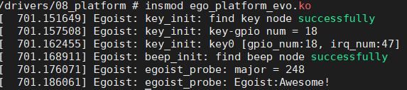

## Introduce

In this directory, I will achieve a standard platform driver framework, and add content gradually.

Hence, there would be two files below:

- ego_platform.c

  > basic platform framework

- ego_platform_evo.c

  > more functionalities


## Migration verification

After loading the module named `ego_platform_evo.ko`, screen would outputs as below:



At the same time, the corresponding class and devices will be created.

**Class**

```zsh
cd /sys/class/egoist
```


As a result of `ego_char_led.c` of transplantation, you can also`echo xxx(ms) > duration` to change the runtime of the beep.

**Dev**


---

**As a platform drv, something extra is coming**


A platform driver is register to corresponding bus `sys/bus/platform/driver/Egoist_drv`

and the `egoist` is linked to `/sys/bus/platform/devices/egoist`, which was associated with this driver.

Of course, the device is associate with the driver, they are associate by `compatible`.


---

**Compatible**

driver:


fdt:

