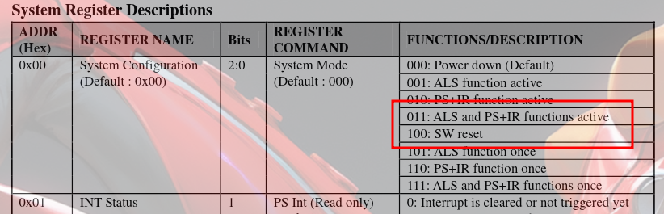
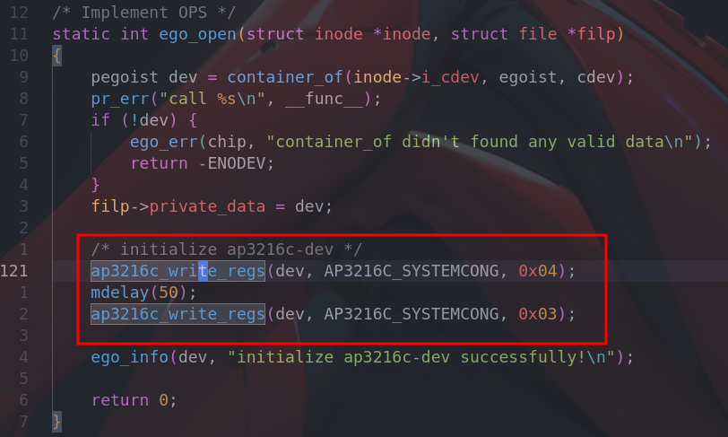
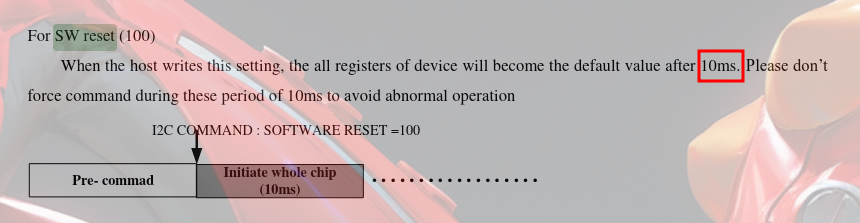
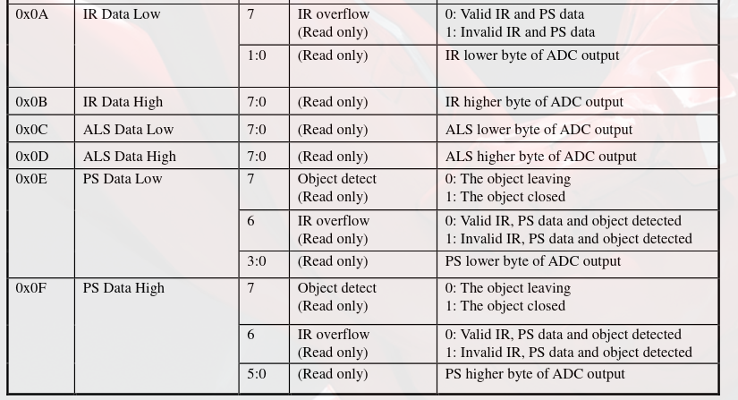
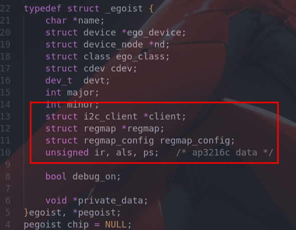
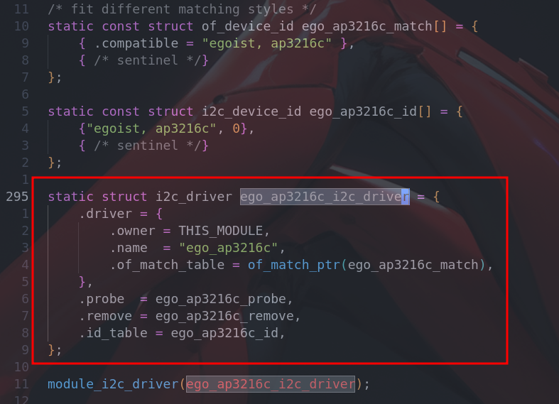
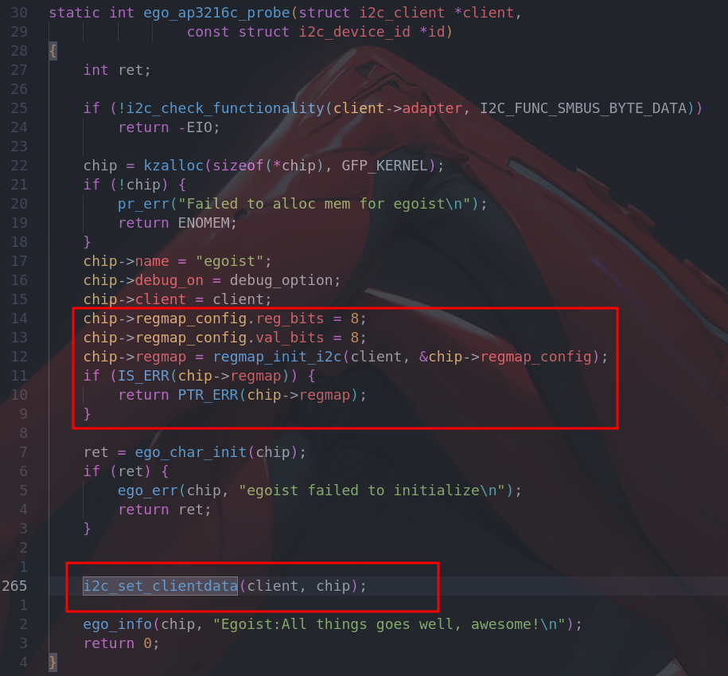
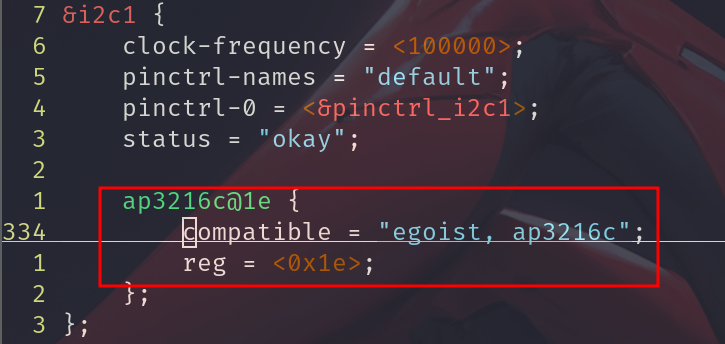
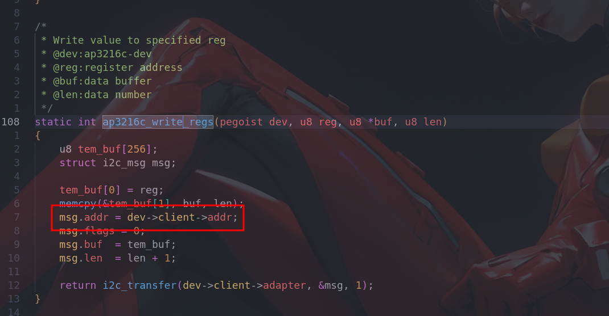

# IIC Driver

In this chapter, I'm going to write three drivers for IIC dev

- AP3216C
- Max30102
- Oled


## AP3216C

### Date sheet

**Brief Description**

It's an integrated ALS & PS module that indicates a digital ambient light sensor[ALS], a proximity sensor[PS], and an IR LED in a single package.

**Features**

- I2C interface(FS mode @400k Hz)
- Mode select: ALS, PS+IR, ALS+PS+IR, PD, ALS once, SW Reset, PS + IR once and ALS+PS+IR once
- ... ...

**I2C Slave Address**

Standard 7-bit slave address that compliances to I2C protocol

- 0X1E, *fixed*

**Mode Select**

At this time, what I need to develop a driver program to power this `ap3216c` and inspect basic functions.

So I choose the mode `ALS and PS+IR function active`, read the register description as shown below:

****

**Actions**

In the `open operation`, I reset the device and enable corresponding functions by writing registers



As the picture shows above, I add a `mdelay(50)` between the two register writes. You can change the delay time but at least 10 ms



**Got Raw Data**

Just read correspond register simply



### Driver program

**Build basic I2C driver framework**

`ego_ap3216c.c`, transplant from `ego_platform.c`, add **I2C device instance** `i2c_client` and R/W framework instance `regmap` with its config `regmap_config`



Add **I2C driver instance** `i2c_driver` build the basic I2C driver framework. What's else ,as you can see in the below picture, there are two `match style`. I only use the fdt style to find device info, but I defined the `i2c_device_id` anyway to make sure my driver can runs before linux-kernel-4.10.

```c
/* before linux-kernel-4.10, this means the id_table is must, even if it's not used */
if (!driver->probe || !driver->id_table)
  			return -ENODEV;
/* after linux-kernel-4.10 */
if (!driver->id_table &&
   !i2c_of_match_device(dev->driver->of_match_table, client))
  			return -ENODEV;
```



**Initialize**

Linux kernel IIC-Core has a strong support for i2c-driver, what I need to do is just initializing the regmap for register I/O and set the IIC client for other code-block in the probe function.

****

The probe function will be exec after corresponding I2C device was matched based on fdt-property `compatible`



**Handle Data**

I get raw data by read register directly in `fsops-read`, see source code `ego_ap3216c.c` for more details


## Question Record

#### -1- Driver had been registered

```bash
Error: Driver `ap3216c` is already registered, aborting...
```

The driver that I'm going to insmod named `ap3216c` and it's a driver for I2C device. So I went to the directory `/sys/bus/i2c/drivers/` to check if there were drivers with the same name. There was a directory entry named `ap3216c` as expected. Although it didn't run it's probe, this driver was already registered to corresponding bus(I2C) though `module_i2c_driver`.

To avoid this problem:

- change my own driver's name
- change the registered but conflicting driver's name
- remove compile item of the conflicting driver in the Makefile

---

#### -2-Unable to handle kernel NULL pointer

```bash
Unable to handle kernel NULL pointer dereference at virtual address 00000002
...
PC is at ap3216c_write_regs.constprop.0+0x24/0x50 [ego_ap3216c]
...
Segmentation fault
```

I've got crazy about this question, it looks like I had manipulated a NULL pointer. According to the above error-message, jump to the source code `ap3216c_write_regs` as below shows.



Note the area in the red box, `dev->client` is chief culprit. It's declared as a pointer,  I just initialize the structure `egoist` it belongs to but forgot to give it a initial value.


To solve this problem, just give the parameter `client` in `probe` as follows:


