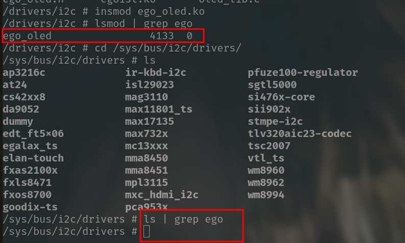
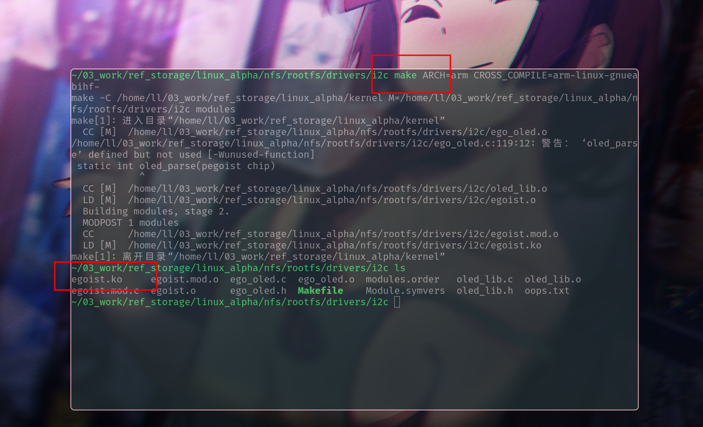
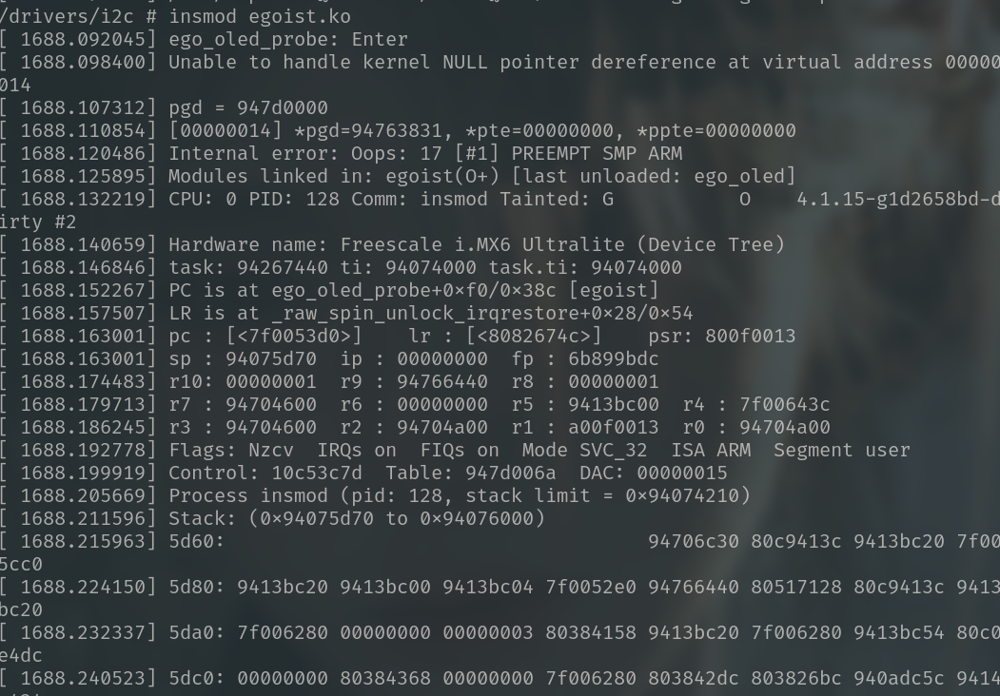
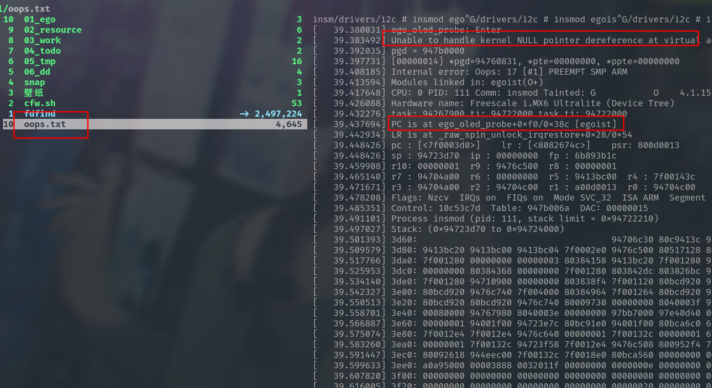
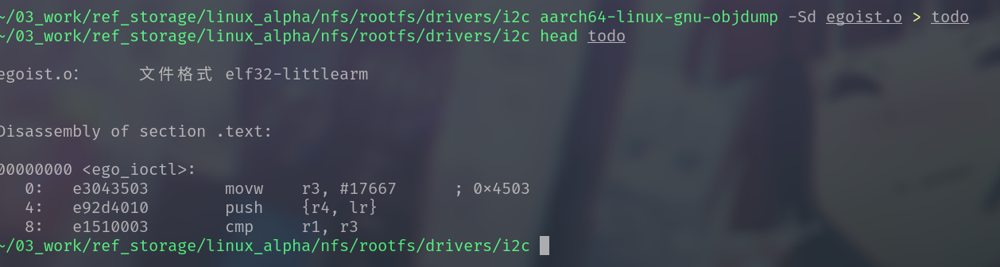
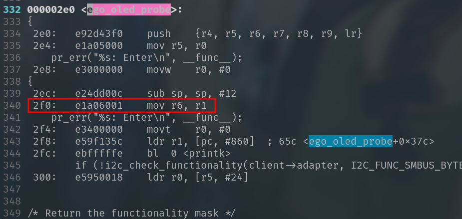

# Errors

### -1- My driver cannot be add to the I2C bus

After I insmod the `ego_oled.ko`, the module is add to the system successfully, but the driver cannot attach to I2C bus. As a result, the driver don't work, because there's nothing to match with my I2C device.



At the first time, I though I code the wrong `compatible property`. I change the directory and check my I2C device and cat it's compatible, I got the compatible property of the driver in the same time. Of course, they were both right.

After that, I check the I2C-framework of my driver, check the API for registering I2C driver, It's also right. It's amazing, I just can't understand.

I go to read some books, the difference between with previous ones which all succeed is adding an additional oled-lib written by myself. I guessed there's something wrong with the `Makefile`

~~~makefile
KERNELDIR := /home/ll/03_work/ref_storage/linux_alpha/kernel
CURRENT_PATH := $(shell pwd)

obj-m := ego_oled.o
ego_oled-y := oled_lib.o

build: kernel_modules

kernel_modules:
	$(MAKE) -C $(KERNELDIR) M=$(CURRENT_PATH) modules

clean:
	$(MAKE) -C $(KERNELDIR) M=$(CURRENT_PATH) clean
~~~

The line 4~5, I wrote the wrong dependency. The right one should be:

~~~makefile
egoist-objs := ego_oled.o oled_lib.o
obj-m := egoist.o
~~~

**After I got changes as above, I made the driver OK to be attached to I2C bus, It works!**

**Well, some Oops happened, but as it runs, I can make it OK**






### -2 -  Solve Oops

**First of all, stored Oops log in a file `oops.txt`.** 

> I use the minicom to cap log



Go to Makefile and added symbol-table, rebuilt.

~~~makefile
KBUILD_CFLAGFS += -g
~~~

And then, I disassembly the file `egoist.o`





After some debug, I located the error : `line-4 switch (id->driver_data)`

```c
static int ego_oled_probe(struct i2c_client *client,
                const struct i2c_device_id *id){
	... ...
	switch (id->driver_data) {
    case SSD1306:
        oled_operation.ID = SSD1306;
        break;
        case SH1106:
        oled_operation.ID = SH1106;
        break;
    }

static const struct of_device_id ego_oled_match[] = {
    { .compatible = "ego, ssd1306"},
    { /* sentinel */}
};

static const struct i2c_device_id ego_oled_id[] = {
    {"ego, ssd1306", 0},
    {"ego, ssd1306",  1},
    { /* sentinel */}
};
    
/* FDT */
    ssd1306@3c {
		compatible = "ego, ssd1306";
		reg = <0x3c>;
	};
```

Because I used both the `of_device_id` and `i2c_device_id` , but the format of `i2c_device_id` is wrong, it will never works, I guess it should be a complete and contiguous string. And in this case, `of_device_id`  had matched. unfortunately, there's nothing given to `id` . So the  `id->driver_data` is a de-reference to a NULL Point.


