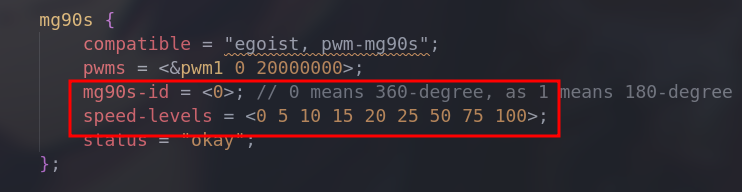
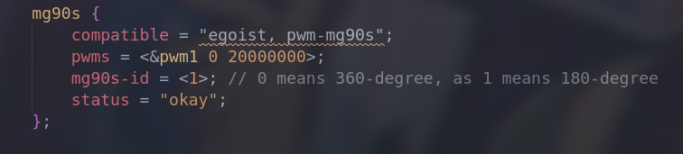
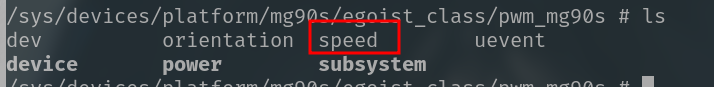
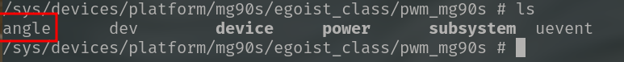

# PWM MG90S

| Date       | Author  | Description          |
| ---------- | ------- | -------------------- |
| 2023/07/20 | Manfred | First release        |
| 2023/07/21 | Manfred | Add MG90S 180-degree |

**General description**

MG90S can be driven by specific PWM waves. It has two models, and each model has different responses to PWM. The period should be around 20ms around.

- 360-degree model

    > **valid duty cycle(ms)**
    >
    > [0.5, 1.5)	Continuously forward rotation
    >
    > 1.5			  Stop
    >
    > (1.5.2.5]     Continuously reversal rotation
    >
    > **Speed**
    >
    > The larger the absolute difference between the duty cycle and 1.5, the faster the speed

- 180-degree model

    >**valid duty cycle (ms) (degree)**
    >
    > [0.5, 2.5]    0 -> 180

**Physical map**


# FDT

**360-degree model**



`speed-levels` is the scale of speed levels, and the `mg90s-id` determines the model of MG90S.

**180-degree model**



Just change the `mg90s-id` to 1

# Driver

[ego_pwm.c](./ego_pwm.c)

**Reference**

`drivers/video/backlight/pwm_bl.c`

`linux-5.10.102/Documentation/driver-api/pwm.rst`

**Platform architecture**

```c
static const struct of_device_id ego_of_match[] = {
    {.compatible = "egoist, pwm-mg90s"},
    {/* Sentinel */},
};

static struct platform_driver egoist_drv = {
    .probe         = egoist_probe,
    .remove        = egoist_remove,
    .driver        = {
        .name      = "Egoist_drv",
        .owner     = THIS_MODULE,
        .of_match_table = ego_of_match,
    }
};
module_platform_driver(egoist_drv);
```

**Core operation**

```c
static int  pwm_update_status(pegoist chip)
{
    chip->duty_cycle = compute_duty_cycle(chip);

    pwm_config(chip->pwm, chip->duty_cycle, chip->period);
    pwm_enable(chip->pwm);
    
    ego_info(chip, "duty_cycle:%u, peirod:%d\n", chip->duty_cycle, chip->period);

    return 0;
}
```

**Sysfs interface**

**360-degree**

- speed

    > The range of the speed is determined by `speed-levels` of FDT. The higher the value of speed, the faster the MG90S will rotate

- orientation

    - 0(default) : clockwise
    - 1: counterclockwise




**180-degree**

- angle

    >  The `angle` represents the angle of the servo. The range of the it is from 0 to 180 degree, which determines the duty cycle of pwm-out-waves.


